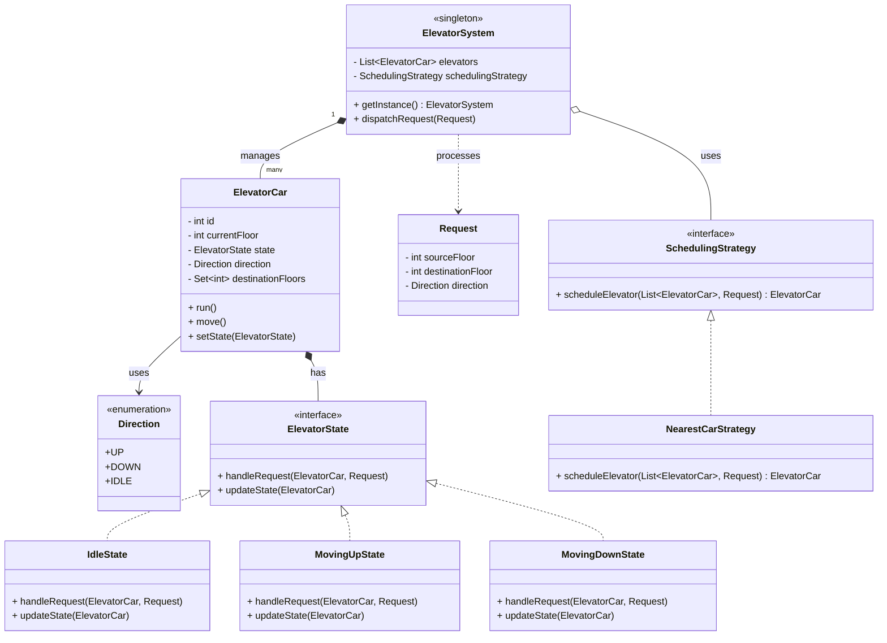
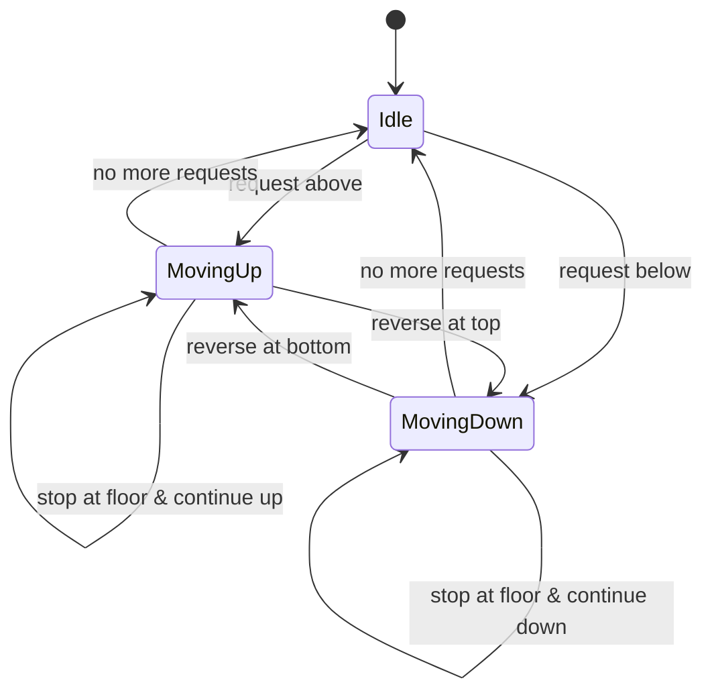
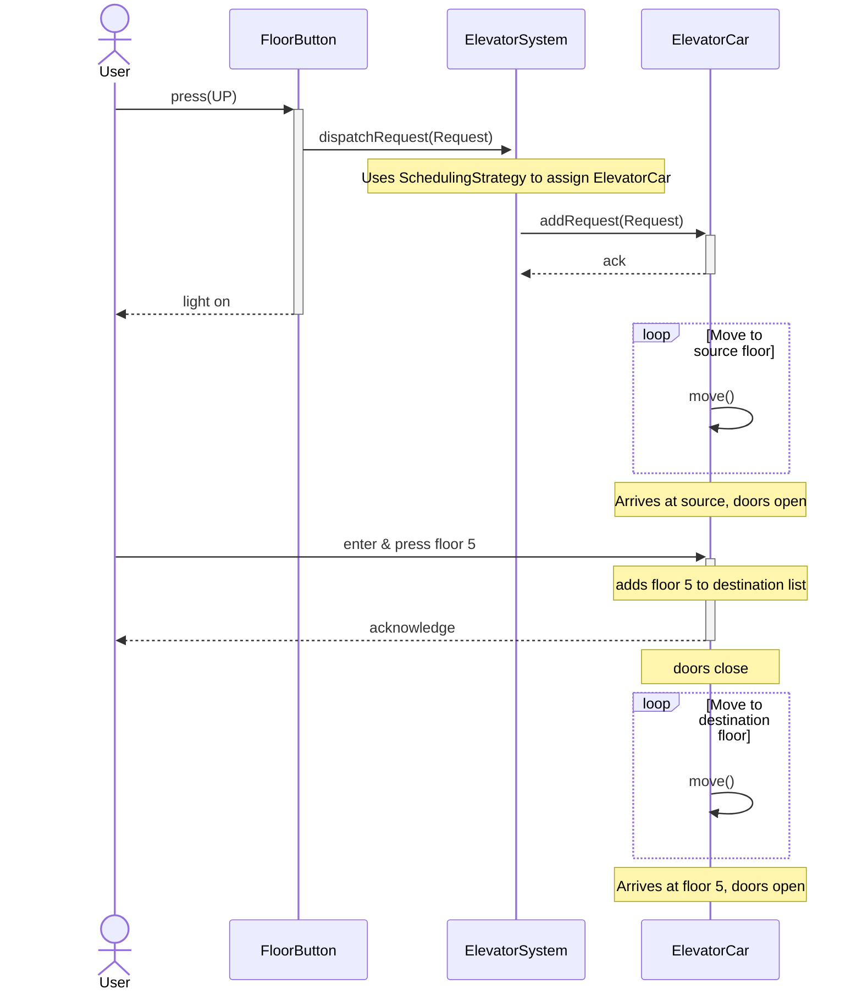

# UML Diagrams for Elevator System

This file contains the Mermaid diagrams for the Class, State, and Sequence flows.

---

## 1. Class Diagram

This diagram shows the classes, their attributes, methods, and the relationships between them (inheritance, aggregation, composition).

---

## 2. State Diagram
This diagram illustrates the possible states of an ElevatorCar and the transitions between them.

## 3. Sequence Diagram (User Journey)
This diagram shows the sequence of interactions when a user calls an elevator and travels to a destination floor.

