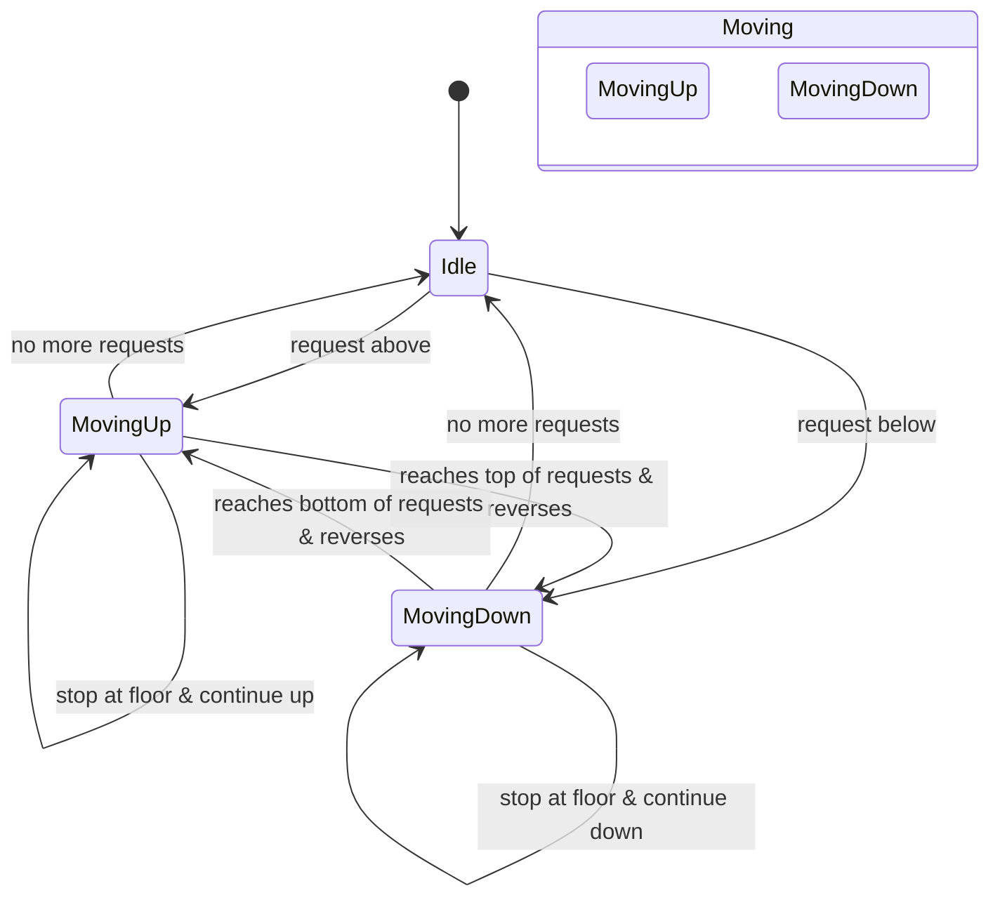
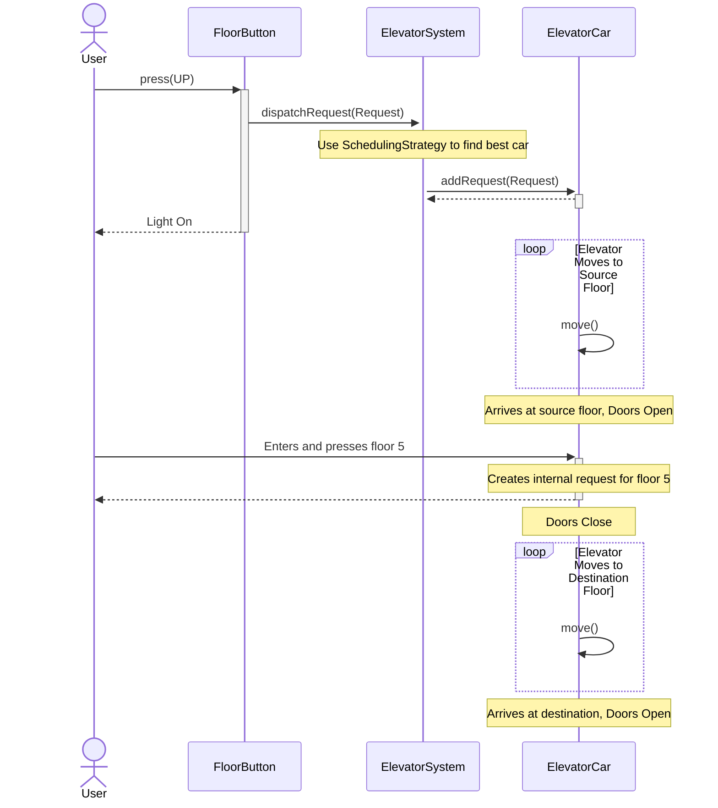

# UML Diagrams for Elevator System

This file contains the Mermaid diagrams for the Class, State, and Sequence flows.

## 1. Class Diagram

This diagram shows the classes, their attributes, methods, and the relationships between them (inheritance, aggregation, composition).

```mermaid
classDiagram
    direction "Direction" {
        <<Enumeration>>
        UP
        DOWN
        IDLE
    }

    class ElevatorSystem {
        <<Singleton>>
        -List~ElevatorCar~ elevators
        -SchedulingStrategy schedulingStrategy
        +getInstance() : ElevatorSystem
        +dispatchRequest(Request)
    }

    class ElevatorCar {
        -int id
        -int currentFloor
        -ElevatorState state
        -Direction direction
        -Set~int~ destinationFloors
        +run()
        +move()
        +setState(ElevatorState)
    }

    class Request {
        -int sourceFloor
        -int destinationFloor
        -Direction direction
    }

    class ElevatorState {
        <<Interface>>
        +handleRequest(ElevatorCar, Request)
        +updateState(ElevatorCar)
    }

    class IdleState {
        +handleRequest(ElevatorCar, Request)
        +updateState(ElevatorCar)
    }
    class MovingUpState {
        +handleRequest(ElevatorCar, Request)
        +updateState(ElevatorCar)
    }
    class MovingDownState {
        +handleRequest(ElevatorCar, Request)
        +updateState(ElevatorCar)
    }

    class SchedulingStrategy {
        <<Interface>>
        +scheduleElevator(List~ElevatorCar~, Request) : ElevatorCar
    }
    class NearestCarStrategy {
        +scheduleElevator(List~ElevatorCar~, Request) : ElevatorCar
    }

    ElevatorSystem "1" *-- "many" ElevatorCar : manages
    ElevatorSystem o-- "1" SchedulingStrategy : uses
    ElevatorSystem ..> Request : processes

    ElevatorCar "1" *-- "1" ElevatorState : has a
    ElevatorCar ..> direction

    ElevatorState <|.. IdleState
    ElevatorState <|.. MovingUpState
    ElevatorState <|.. MovingDownState

    SchedulingStrategy <|.. NearestCarStrategy
```

## 2. State Diagram
This diagram illustrates the possible states of an ElevatorCar and the transitions between them.


## 3. Sequence Diagram (User Journey)
This diagram shows the sequence of interactions when a user calls an elevator and travels to a destination floor.
