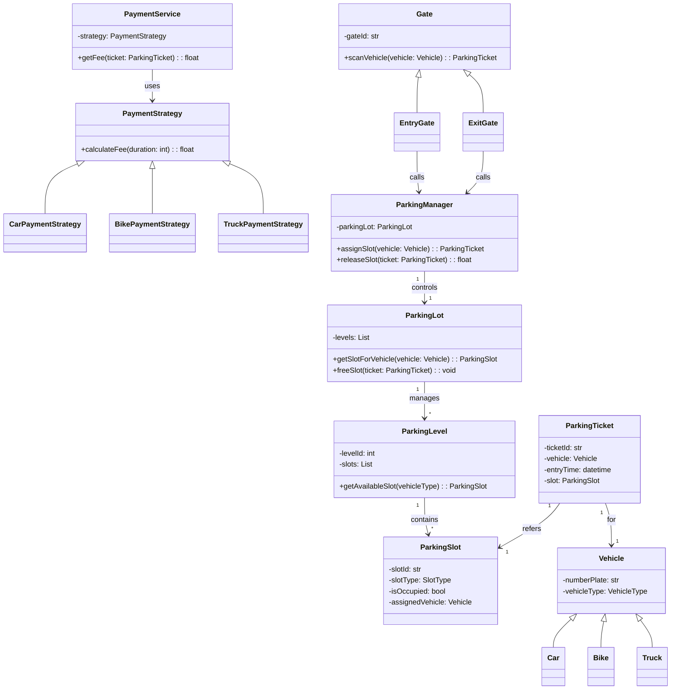
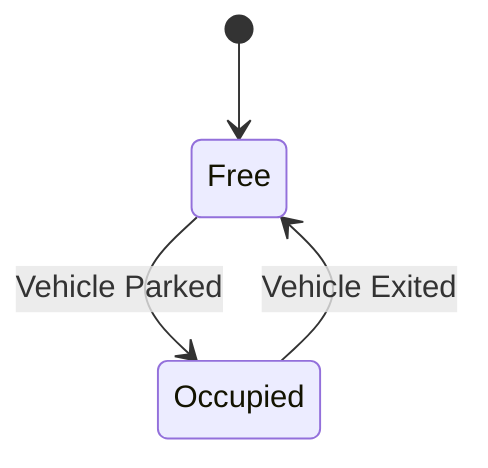
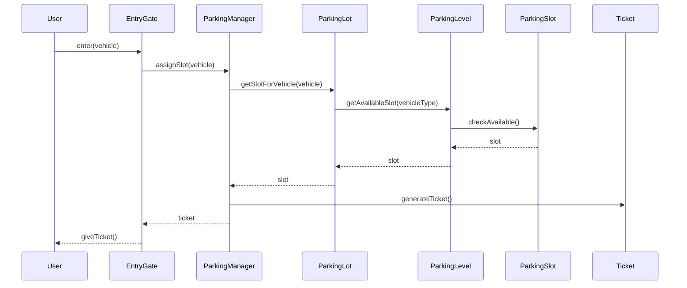
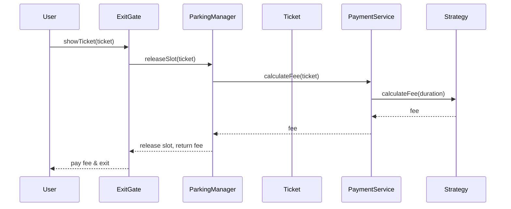

# UML – Parking Lot System
---

## Class Diagram

```mermaid
classDiagram
class Vehicle {
  -numberPlate: str
  -vehicleType: VehicleType
}

class Car
class Bike
class Truck

Vehicle <|-- Car
Vehicle <|-- Bike
Vehicle <|-- Truck

class ParkingSlot {
  -slotId: str
  -slotType: SlotType
  -isOccupied: bool
  -assignedVehicle: Vehicle
}

class ParkingLevel {
  -levelId: int
  -slots: List<ParkingSlot>
  +getAvailableSlot(vehicleType): ParkingSlot
}

class ParkingLot {
  -levels: List<ParkingLevel>
  +getSlotForVehicle(vehicle: Vehicle): ParkingSlot
  +freeSlot(ticket: ParkingTicket): void
}

class ParkingTicket {
  -ticketId: str
  -vehicle: Vehicle
  -entryTime: datetime
  -slot: ParkingSlot
}

class Gate {
  -gateId: str
  +scanVehicle(vehicle: Vehicle): ParkingTicket
}

class EntryGate
class ExitGate

Gate <|-- EntryGate
Gate <|-- ExitGate

class PaymentStrategy {
  +calculateFee(duration: int): float
}

class CarPaymentStrategy
class BikePaymentStrategy
class TruckPaymentStrategy

PaymentStrategy <|-- CarPaymentStrategy
PaymentStrategy <|-- BikePaymentStrategy
PaymentStrategy <|-- TruckPaymentStrategy

class PaymentService {
  -strategy: PaymentStrategy
  +getFee(ticket: ParkingTicket): float
}

class ParkingManager {
  -parkingLot: ParkingLot
  +assignSlot(vehicle: Vehicle): ParkingTicket
  +releaseSlot(ticket: ParkingTicket): float
}

ParkingLevel "1" --> "*" ParkingSlot : contains
ParkingLot "1" --> "*" ParkingLevel : manages
ParkingTicket "1" --> "1" ParkingSlot : refers
ParkingTicket "1" --> "1" Vehicle : for
ParkingManager "1" --> "1" ParkingLot : controls
EntryGate --> ParkingManager : calls
ExitGate --> ParkingManager : calls
PaymentService --> PaymentStrategy : uses
```

## State Diagram – Parking Slot

```mermaid
stateDiagram-v2
    [*] --> Free
    Free --> Occupied : Vehicle Parked
    Occupied --> Free : Vehicle Exited
```

## Sequence Diagram – Vehicle Entry Flow

```mermaid
sequenceDiagram
    participant User
    participant EntryGate
    participant ParkingManager
    participant ParkingLot
    participant ParkingLevel
    participant ParkingSlot
    participant Ticket

    User ->> EntryGate: enter(vehicle)
    EntryGate ->> ParkingManager: assignSlot(vehicle)
    ParkingManager ->> ParkingLot: getSlotForVehicle(vehicle)
    ParkingLot ->> ParkingLevel: getAvailableSlot(vehicleType)
    ParkingLevel ->> ParkingSlot: checkAvailable()
    ParkingSlot -->> ParkingLevel: slot
    ParkingLevel -->> ParkingLot: slot
    ParkingLot -->> ParkingManager: slot
    ParkingManager ->> Ticket: generateTicket()
    ParkingManager -->> EntryGate: ticket
    EntryGate -->> User: giveTicket()
```

## Sequence Diagram – Vehicle Exit Flow

```mermaid
sequenceDiagram
    participant User
    participant ExitGate
    participant ParkingManager
    participant Ticket
    participant PaymentService
    participant Strategy

    User ->> ExitGate: showTicket(ticket)
    ExitGate ->> ParkingManager: releaseSlot(ticket)
    ParkingManager ->> PaymentService: calculateFee(ticket)
    PaymentService ->> Strategy: calculateFee(duration)
    Strategy -->> PaymentService: fee
    PaymentService -->> ParkingManager: fee
    ParkingManager -->> ExitGate: release slot, return fee
    ExitGate -->> User: pay fee & exit
```

