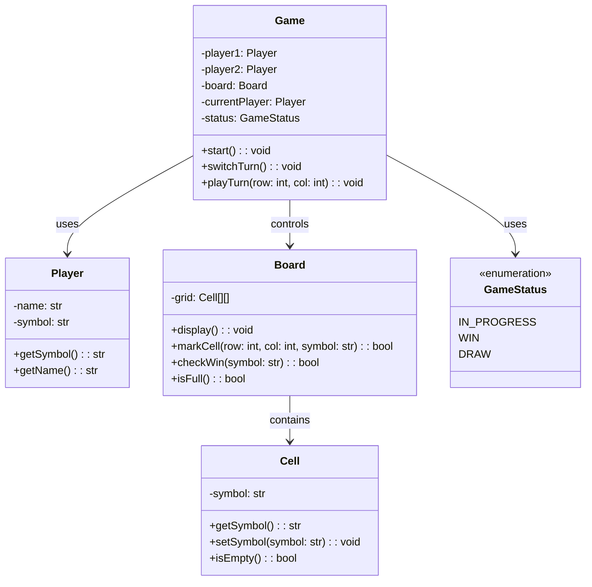

# 📐 UML – Tic Tac Toe System

```mermaid
classDiagram

%% Player class
class Player {
  -name: str
  -symbol: str
  +getSymbol(): str
  +getName(): str
}

%% Cell class
class Cell {
  -symbol: str
  +getSymbol(): str
  +setSymbol(symbol: str): void
  +isEmpty(): bool
}

%% Board class
class Board {
  -grid: Cell[][]
  +display(): void
  +markCell(row: int, col: int, symbol: str): bool
  +checkWin(symbol: str): bool
  +isFull(): bool
}

%% Game class
class Game {
  -player1: Player
  -player2: Player
  -board: Board
  -currentPlayer: Player
  -status: GameStatus
  +start(): void
  +switchTurn(): void
  +playTurn(row: int, col: int): void
}

%% Enum for status
class GameStatus {
  <<enumeration>>
  IN_PROGRESS
  WIN
  DRAW
}

%% Relationships
Game --> Player : uses
Game --> Board : controls
Game --> GameStatus : uses
Board --> Cell : contains
```