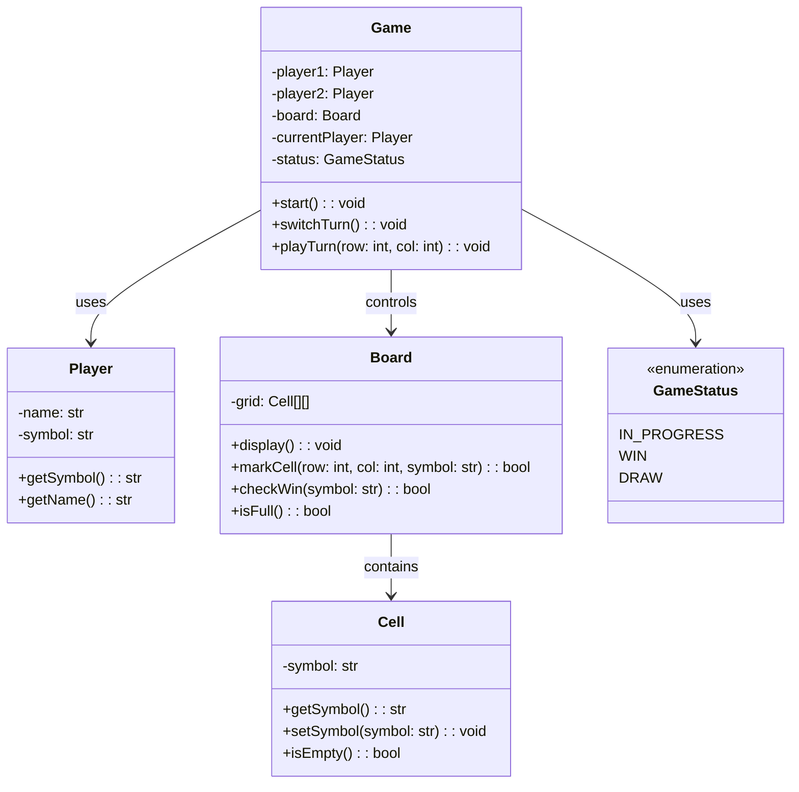

# 📐 UML – Tic Tac Toe System

```mermaid
classDiagram

%% Player class
class Player {
  -name: str
  -symbol: str
  +getSymbol(): str
  +getName(): str
}

%% Cell class
class Cell {
  -symbol: str
  +getSymbol(): str
  +setSymbol(symbol: str): void
  +isEmpty(): bool
}

%% Board class
class Board {
  -grid: Cell[][]
  +display(): void
  +markCell(row: int, col: int, symbol: str): bool
  +checkWin(symbol: str): bool
  +isFull(): bool
}

%% Game class
class Game {
  -player1: Player
  -player2: Player
  -board: Board
  -currentPlayer: Player
  -status: GameStatus
  +start(): void
  +switchTurn(): void
  +playTurn(row: int, col: int): void
}

%% Enum for status
class GameStatus {
  <<enumeration>>
  IN_PROGRESS
  WIN
  DRAW
}

%% Relationships
Game --> Player : uses
Game --> Board : controls
Game --> GameStatus : uses
Board --> Cell : contains
```

# 🔄 Game Flow – Tic Tac Toe

```mermaid
flowchart TD
    Start([Start Game])
    InitPlayers[Initialize Players]
    InitBoard[Initialize Board]
    GameLoop{Is Game In Progress?}
    ShowBoard[Display Board]
    Input[Player Inputs Row and Column]
    ValidateMove{Is Move Valid?}
    MarkCell[Mark Cell]
    CheckWin{Did Current Player Win?}
    Win[Show Winner and End Game]
    CheckDraw{Is Board Full?}
    Draw[Declare Draw and End Game]
    SwitchPlayer[Switch Current Player]
    End([End])

    Start --> InitPlayers --> InitBoard --> GameLoop
    GameLoop --> ShowBoard --> Input --> ValidateMove
    ValidateMove -- No --> Input
    ValidateMove -- Yes --> MarkCell --> CheckWin

    CheckWin -- Yes --> Win --> End
    CheckWin -- No --> CheckDraw

    CheckDraw -- Yes --> Draw --> End
    CheckDraw -- No --> SwitchPlayer --> GameLoop
```