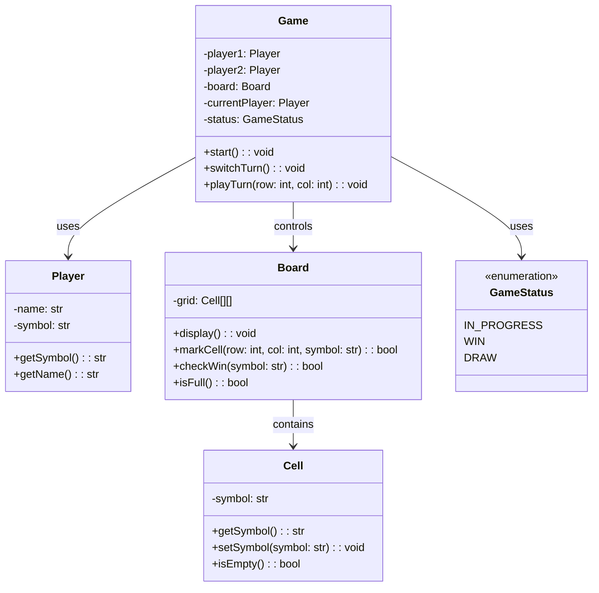
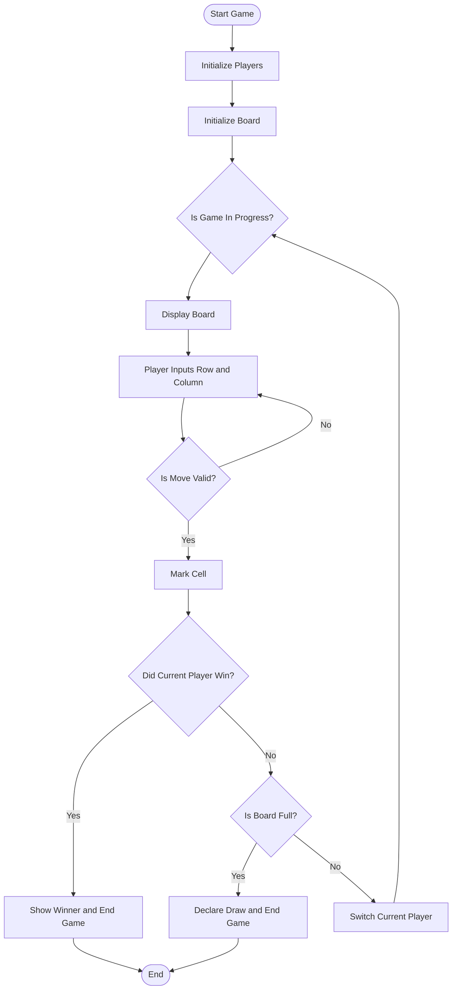
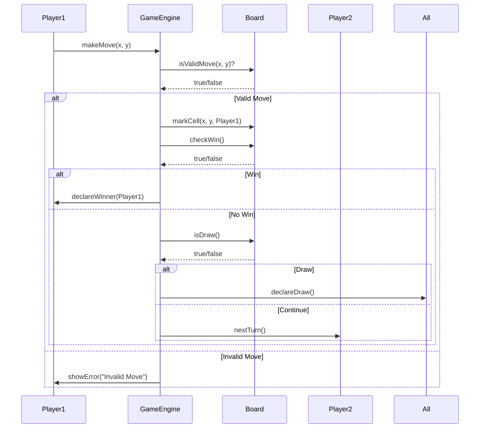
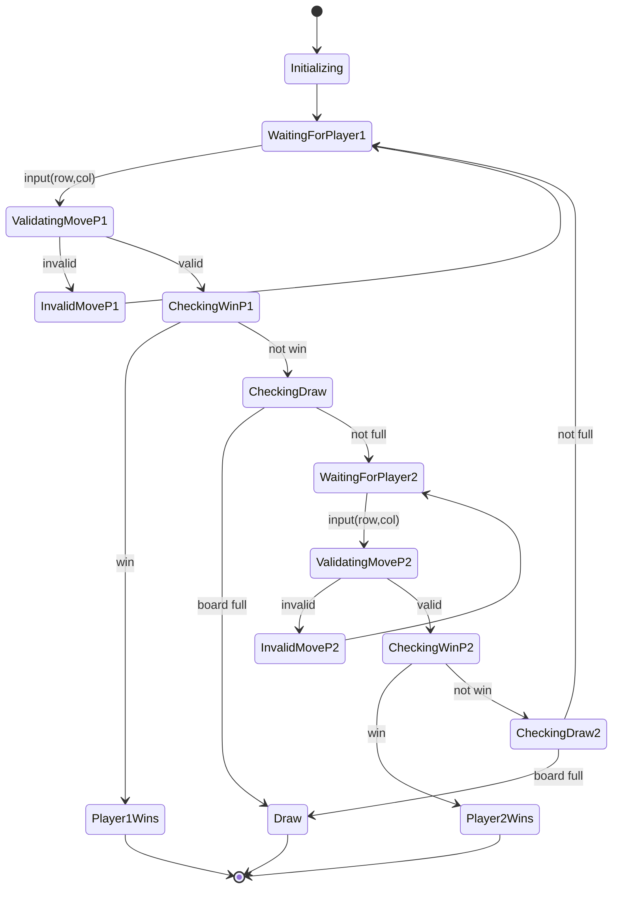

# 📐 UML – Tic Tac Toe System

```mermaid
classDiagram

%% Player class
class Player {
  -name: str
  -symbol: str
  +getSymbol(): str
  +getName(): str
}

%% Cell class
class Cell {
  -symbol: str
  +getSymbol(): str
  +setSymbol(symbol: str): void
  +isEmpty(): bool
}

%% Board class
class Board {
  -grid: Cell[][]
  +display(): void
  +markCell(row: int, col: int, symbol: str): bool
  +checkWin(symbol: str): bool
  +isFull(): bool
}

%% Game class
class Game {
  -player1: Player
  -player2: Player
  -board: Board
  -currentPlayer: Player
  -status: GameStatus
  +start(): void
  +switchTurn(): void
  +playTurn(row: int, col: int): void
}

%% Enum for status
class GameStatus {
  <<enumeration>>
  IN_PROGRESS
  WIN
  DRAW
}

%% Relationships
Game --> Player : uses
Game --> Board : controls
Game --> GameStatus : uses
Board --> Cell : contains
```

# 🔄 Game Flow – Tic Tac Toe

```mermaid
flowchart TD
    Start([Start Game])
    InitPlayers[Initialize Players]
    InitBoard[Initialize Board]
    GameLoop{Is Game In Progress?}
    ShowBoard[Display Board]
    Input[Player Inputs Row and Column]
    ValidateMove{Is Move Valid?}
    MarkCell[Mark Cell]
    CheckWin{Did Current Player Win?}
    Win[Show Winner and End Game]
    CheckDraw{Is Board Full?}
    Draw[Declare Draw and End Game]
    SwitchPlayer[Switch Current Player]
    End([End])

    Start --> InitPlayers --> InitBoard --> GameLoop
    GameLoop --> ShowBoard --> Input --> ValidateMove
    ValidateMove -- No --> Input
    ValidateMove -- Yes --> MarkCell --> CheckWin

    CheckWin -- Yes --> Win --> End
    CheckWin -- No --> CheckDraw

    CheckDraw -- Yes --> Draw --> End
    CheckDraw -- No --> SwitchPlayer --> GameLoop
```

# Turn-by-Turn Sequence Diagram

```mermaid
sequenceDiagram
    participant Player1
    participant GameEngine
    participant Board
    participant Player2

    Player1->>GameEngine: makeMove(x, y)
    GameEngine->>Board: isValidMove(x, y)?
    Board-->>GameEngine: true/false
    alt Valid Move
        GameEngine->>Board: markCell(x, y, Player1)
        GameEngine->>Board: checkWin()
        Board-->>GameEngine: true/false
        alt Win
            GameEngine->>Player1: declareWinner(Player1)
        else No Win
            GameEngine->>Board: isDraw()
            Board-->>GameEngine: true/false
            alt Draw
                GameEngine->>All: declareDraw()
            else Continue
                GameEngine->>Player2: nextTurn()
            end
        end
    else Invalid Move
        GameEngine->>Player1: showError("Invalid Move")
    end
```

#  Game State Diagram

```mermaid
stateDiagram-v2
    [*] --> Initializing
    Initializing --> WaitingForPlayer1
    WaitingForPlayer1 --> ValidatingMoveP1 : input(row,col)
    ValidatingMoveP1 --> InvalidMoveP1 : invalid
    InvalidMoveP1 --> WaitingForPlayer1

    ValidatingMoveP1 --> CheckingWinP1 : valid
    CheckingWinP1 --> Player1Wins : win
    CheckingWinP1 --> CheckingDraw : not win

    CheckingDraw --> Draw : board full
    CheckingDraw --> WaitingForPlayer2 : not full

    WaitingForPlayer2 --> ValidatingMoveP2 : input(row,col)
    ValidatingMoveP2 --> InvalidMoveP2 : invalid
    InvalidMoveP2 --> WaitingForPlayer2

    ValidatingMoveP2 --> CheckingWinP2 : valid
    CheckingWinP2 --> Player2Wins : win
    CheckingWinP2 --> CheckingDraw2 : not win

    CheckingDraw2 --> Draw : board full
    CheckingDraw2 --> WaitingForPlayer1 : not full

    Player1Wins --> [*]
    Player2Wins --> [*]
    Draw --> [*]
```
